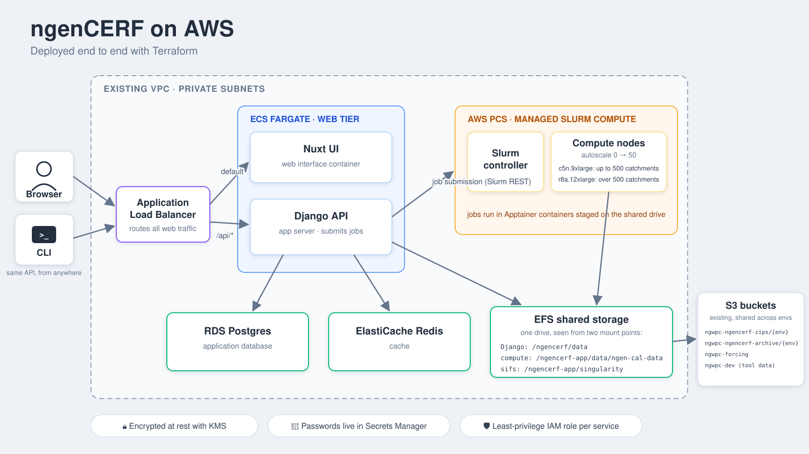

# nwm-ngencerf-infra

Terraform deliverable for the National Water Model **ngenCerf** AWS migration. Provisions the AWS infrastructure that hosts the ngenCerf server, UI, Postgres, Redis, shared filesystem, and the Slurm cluster (via AWS PCS).

## Architecture



- Consumes an existing VPC via data sources (LZA-provisioned for the NGWPC envs); it creates no VPC, subnet, IGW, or NAT
- Private subnets host everything: ECS Fargate tasks (Django API, Nuxt UI), RDS Postgres, ElastiCache Redis, EFS, AWS PCS controller + compute node groups
- ALB is internal for the NGWPC envs (private subnets only; reach it over the VPC / Transit Gateway path); the module still supports a public ALB (`alb_internal = false`) when the VPC supplies public subnets
- Outbound egress rides the VPC's existing path (Transit Gateway to the LZA centralized egress for the NGWPC envs); no IGW or NAT is created
- S3 buckets for archives, run zips, and static model data, reached via a VPC S3 Gateway Endpoint (LZA-provided in the NGWPC VPCs)
- IAM least-privilege role per service
- HTTPS at the ALB (public Route 53 record + ACM cert) is the planned edge; the NGWPC envs currently serve HTTP-only over the internal ALB

## Environments

Three NGWPC environments, each its own root module under `aws/envs/<env>/` with its own state file. All three call the same shared module at `aws/modules/ngencerf/`. The module is VPC-agnostic: it accepts `vpc_id` + `private_subnet_ids` + `public_subnet_ids` as caller-supplied inputs. No env creates a VPC; every env discovers its LZA-laid VPC via `data` sources (`data "aws_vpc"` / `data "aws_subnets"`) and passes the IDs into the module.

Sizing is uniform across all three envs: every env runs the same prod-tier resources (`db.r7g.large` RDS + 200 GiB, `cache.r7g.large` Redis, c5n.9xlarge / r8a.12xlarge PCS compute, 8 vCPU / 16 GiB Django, 2 vCPU / 4 GiB Nuxt) so sandbox regression-tests against prod-shaped infrastructure. Only the per-env `production` flag varies (it gates multi-AZ RDS, Redis failover, and deletion protection); `sandbox` keeps it off so it stays quick to tear down.

| Env                  | Account                | VPC source       | RDS class      |
|----------------------|------------------------|------------------|----------------|
| `sandbox`            | NGWPC Sandbox          | LZA data lookup  | db.r7g.large   |
| `ea`                 | NGWPC Test             | LZA data lookup  | db.r7g.large   |
| `uat2`               | NGWPC Test             | LZA data lookup  | db.r7g.large   |

`ea` and `uat2` are the public customer-acceptance envs. They run the identical stack with the ALB still internal; internet traffic arrives through the centralized public edge (an internet-facing ALB behind WAF in the Network account, forwarding to an NLB in the Test account that targets each env's internal ALB), with public DNS at `https://ngencerf-ea.nextgenwaterprediction.com` and `https://ngencerf-uat2.nextgenwaterprediction.com`. Both set the module's `public_url` input (wires the Django CSRF trusted origin, `X-Forwarded-Proto` trust, and the UI's browser-facing API base), pin immutable timestamped image tags, and run the WAF in `block` mode.

**Resource sizing (uniform across all envs).** Every env runs the same prod-tier sizes; only the `production` flag (multi-AZ RDS, Redis failover, deletion protection) differs per env. PCS compute autoscales from 0, so it bills only while a job runs. Every size below is a module variable with the prod default shown; any env can override it per-resource in its `main.tf` (e.g. `nuxt_cpu`, `django_memory`, `rds_instance_class`, `pcs_controller_size`, `pcs_max_nodes_per_partition`).

| Tier                  | Resource                   | Size                                                  |
|-----------------------|----------------------------|-------------------------------------------------------|
| Web (Fargate)         | Django (`ngencerf-server`) | 8 vCPU / 16 GiB, desired_count 1                      |
| Web (Fargate)         | Nuxt UI (`ngencerf-ui`)    | 2 vCPU / 4 GiB, desired_count 1                  |
| Data                  | RDS Postgres               | db.r7g.large, 200 GiB gp3 (multi-AZ when `production`) |
| Data                  | ElastiCache Redis          | cache.r7g.large (2-node failover when `production`)    |
| PCS controller        | Slurm head node            | MEDIUM (sized by node/job count, not an EC2 type)     |
| PCS compute (default) | `c5n-9xlarge` partition    | c5n.9xlarge, autoscale 0-50                           |
| PCS compute (heavy)   | `r8a-12xlarge` partition   | r8a.12xlarge, autoscale 0-50                          |
| PCS login             | ops on-ramp                | c6i.large, fixed 1                                    |

The PCS controller is sized SMALL/MEDIUM/LARGE by the nodes + jobs it tracks, not by EC2 type: MEDIUM supports up to 512 nodes / 8192 jobs, covering the 50-node-per-partition ceiling (SMALL caps at 32). ngenCerf-server routes each job to the `c5n-9xlarge` partition (<=500 catchments) or `r8a-12xlarge` (>500) by catchment count.

### External & Persistent Inputs

Persistent resources and shared account items are explicitly parameterized in each environment's `main.tf` so the shared module avoids hardcoded account or bucket dependencies:

- **S3 Archive & Run Zips**: `ngencerf_archive_s3_path` and `ngencerf_zips_s3_path` (e.g. `s3://ngwpc-ngencerf-archive/<env>/`). Task IAM permissions are scoped to the specified environment prefix (`arn:aws:s3:::bucket/prefix/*`) for least privilege (NIST 800-53 AC-6).
- **Static Model Data**: `static_data_s3_path` (e.g. `s3://ngwpc-dev/nwm-tools-data/`). Read-only IAM access is granted to Django and the PCS node role, and read by `bootstrap.sh` to stage static retrospective data and ESMF weights onto EFS.
- **Cross-Account Data KMS**: `data_s3_kms_key_arn` sets the customer-managed KMS key ARN used by CMK-encrypted cross-account buckets. When configured, grants `kms:Decrypt`, `kms:GenerateDataKey`, and `kms:DescribeKey` to Django and PCS node roles.
- **Container Registries & Staging**: `sif_registry_base` (default `ghcr.io/ngwpc`) and `oras_image` (default `ghcr.io/oras-project/oras:v1.3.2`) allow pointing SIF artifact downloads and utility tools to ECR mirrors or private registries.
- **Active Directory / LDAP**: `ldap_domain` and `ldap_user_search_base_dn` configure the Active Directory domain and user search base for Django authentication when AD is enabled.
- **Session Manager Logging Policy**: `session_manager_logging_policy_name` defaults to `AWSAccelerator-SessionManagerLogging` for LZA accounts; set to `""` to omit policy attachment when deploying to non-LZA accounts.
- **AMI Configurations**:
  - `pcs_compute_ami_id`: Optional explicit pin for compute nodes (defaults to in-account Image Builder AMI if `build_compute_ami = true`, else PCS DLAMI sample AMI).
  - `pcs_login_ami_id`: Optional explicit pin for the login node (defaults to AWS PCS DLAMI sample AMI from public SSM parameter `/aws/service/pcs/ami/dlami-base-ubuntu2404/x86_64/latest/ami-id`).
  - `imagebuilder_parent_image`: Optional parent image for EC2 Image Builder recipe (defaults to Canonical Ubuntu 24.04 LTS from public SSM parameter `/aws/service/canonical/ubuntu/server/24.04/stable/current/amd64/hvm/ebs-gp3/ami-id`).

## Prerequisites

- AWS CLI v2 installed and authenticated to the target account (`aws sts get-caller-identity` works)
- Terraform `>= 1.10` (`terraform version`), required for native S3 state locking
- Permissions in the target AWS account to create VPC, IAM, RDS, ECS, S3, KMS resources
- Python `>= 3.10` and `pre-commit` installed if you'll be developing this repo (`pip install pre-commit`)
- `tflint` and `checkov` installed for lint targets (`brew install tflint checkov` on macOS)

### AWS SSO login profile (one-time)

CLI access uses IAM Identity Center (SSO): short-lived credentials, no long-term access keys. Define one profile per target account in `~/.aws/config`:

```ini
[sso-session <org-session-name>]
sso_start_url = <your-identity-center-start-url>
sso_region = us-east-1
sso_registration_scopes = sso:account:access

[profile ngwpc-sandbox]
sso_session = <org-session-name>
sso_account_id = <sandbox-account-id>
sso_role_name = <your-role-in-that-account>
region = us-east-1
output = json
```

`aws configure sso` builds the same thing interactively. Then, whenever you work against the account:

```bash
aws sso login --profile ngwpc-sandbox   # opens the browser; sessions last ~8h
export AWS_PROFILE=ngwpc-sandbox
aws sts get-caller-identity             # confirm the expected account id before any terraform command
```

## First run (per-account, one-time)

The Terraform state backend (S3 bucket + customer-managed KMS key) has to exist before any env can use it as a backend. The `aws/bootstrap/` module solves this. **Run it once in any account that needs Terraform to create its own state backend.** The NGWPC Sandbox, Test, and Optimization accounts already have pre-existing infra state buckets (`ngwpc-infra-test` / `ngwpc-infra-oe`); those envs consume that shared infrastructure via different state keys rather than bootstrapping their own. How those buckets were provisioned (LZA vs manual) is unverified.

State locking uses S3's native lock-file mechanism (`use_lockfile = true`); DynamoDB is **not** used. That pattern is deprecated as of Terraform 1.10.

See `aws/bootstrap/README.md` for the exact sequence: a 6-step flow that takes ~5 minutes and you never run again.

After bootstrap completes, fill in `aws/envs/<env>/backend.hcl` and `aws/envs/<env>/terraform.tfvars` for the env you're spinning up, then:

```bash
make init      ENV=sandbox   # terraform init using the env's backend.hcl
make plan      ENV=sandbox   # see the diff
make apply     ENV=sandbox   # apply changes
make bootstrap ENV=sandbox   # stage workload SIFs + ngen static data onto EFS (after apply)
make smoke     ENV=sandbox   # end-to-end smoke test (after bootstrap)
make destroy   ENV=sandbox   # tear it down (saves cost)
```

## Day-to-day commands

All targets accept `ENV=<env>` (default `sandbox`). Valid envs: `sandbox`, `ea`, `uat2`.

```bash
make help                          # list all targets
make plan ENV=ea                   # plan the EA env (NGWPC Test account)
make apply ENV=uat2                # apply the UAT2 env (NGWPC Test account)
make destroy ENV=sandbox           # destroy sandbox (cost saver)
make smoke ENV=sandbox             # end-to-end smoke against sandbox
make fmt                           # terraform fmt -recursive
make lint                          # tflint + checkov

# Operations & Slurm management
make ecs-restart ENV=ea            # force new deployment on Django + Nuxt tasks
make ecs-status ENV=ea             # show task counts, rollout state, task defs
make slurm-queue ENV=ea            # inspect running/pending Slurm jobs (squeue)
make slurm-drain ENV=ea            # drain compute partitions before updating SIFs
make slurm-resume ENV=ea           # resume compute partitions after updates
make slurm-cancel-all ENV=ea       # cancel active/pending Slurm jobs (scancel)
make login-ssm ENV=ea              # launch interactive AWS SSM shell on PCS login node
```

### Safe SIF Updates & Maintenance Flow

Because Slurm compute jobs mount and execute SIF containers from shared EFS, updating SIFs or static data while jobs are running can disrupt active steps (due to in-flight symlink swaps on `/ngencerf-app/singularity/`). Use this safe workflow:

1. **Check or Drain Active Workloads**:
   ```bash
   make slurm-queue ENV=ea          # check for active jobs
   make slurm-drain ENV=ea          # hold new submissions in PENDING
   ```
2. **Stage New SIFs & Static Data**:
   ```bash
   make bootstrap ENV=ea            # stages new SIFs onto EFS (guards against active jobs)
   ```
3. **Restart ECS Tasks & Resume Partitions**:
   ```bash
   make ecs-restart ENV=ea          # refresh Django/Nuxt containers and EFS file handles
   make slurm-resume ENV=ea         # release partitions to schedule queued jobs
   ```

## Dev deploy (ad-hoc container update, no Terraform)

Each env pins the server and UI image tags in its `main.tf` (`ngencerf_server_image`,
`ngencerf_ui_image`), so `terraform apply` is the source of truth for what runs. For fast
dev iteration you can also roll a running ECS service to a new image **without** an apply:
register a new task-def revision and point the service at it:

```bash
export AWS_PROFILE=<env-profile> AWS_REGION=us-east-1
PREFIX=ngencerf-sandbox            # cluster = $PREFIX-cluster; services = $PREFIX-django / $PREFIX-nuxt

# restart / re-pull the current image
aws ecs update-service --cluster "$PREFIX-cluster" --service "$PREFIX-django" --force-new-deployment

# deploy a specific image tag onto the running service
aws ecs describe-task-definition --task-definition "$PREFIX-django" --query taskDefinition --output json \
  | jq --arg I "ghcr.io/ngwpc/ngencerf-server:<tag>" \
      'del(.taskDefinitionArn,.revision,.status,.requiresAttributes,.compatibilities,.registeredAt,.registeredBy,.deregisteredAt) | .containerDefinitions[0].image=$I' \
  > /tmp/td.json
NEWTD=$(aws ecs register-task-definition --cli-input-json file:///tmp/td.json --query 'taskDefinition.taskDefinitionArn' --output text)
aws ecs update-service --cluster "$PREFIX-cluster" --service "$PREFIX-django" --task-definition "$NEWTD"
```

These ad-hoc revisions are invisible to Terraform. The **next `terraform apply` reverts the
service to the tag pinned in `main.tf`**. To make a build permanent, bump the image var in the
env's `main.tf` and apply. (Whether a deploy pipeline should instead own the running image via
a `lifecycle { ignore_changes = [task_definition] }` rule is an open decision.)

## Cost (sandbox, fully running 24x7)

The always-on cost is dominated by the MEDIUM PCS controller (billed hourly even at 0 compute, plus the accounting fee), the data tier (db.r7g.large RDS + cache.r7g.large Redis), and the 8 vCPU / 16 GiB Django Fargate task, on top of the internal ALB (~$0.55/day) and WAFv2 (~$0.37/day). Egress uses the LZA centralized NAT in the Network account, so this stack provisions no NAT Gateway of its own. PCS *compute* (c5n.9xlarge / r8a.12xlarge) autoscales from 0, so it bills only while a job runs.

Tear down nights/weekends with `terraform plan -destroy && apply` from `envs/sandbox/` to cut the running cost during off-hours. State bucket + KMS key for state survive a destroy.

## Compliance posture

This repo is designed to satisfy the security controls applicable to the **FedRAMP Moderate** baseline. **FedRAMP** (the Federal Risk and Authorization Management Program) uses **NIST 800-53 Rev 5** as its control catalog.

> FedRAMP authorization is a process, not a code attribute. This repo is *designed to satisfy* the relevant NIST 800-53 controls; the authorization artifact is produced separately at the organizational level.

### Design-choice -> NIST 800-53 control mapping

| Design choice | Controls |
|---|---|
| Customer-managed KMS keys on RDS, EFS, Redis, Secrets Manager, ECS Logs, state bucket | SC-28 (protection of information at rest) |
| `enable_key_rotation = true` on every CMK | SC-12 (cryptographic key management) |
| TLS in transit: RDS sslmode=verify-full, Redis TLS, S3 over HTTPS | SC-8 (transmission confidentiality), SC-13 (cryptographic protection) |
| Secrets in AWS Secrets Manager; 32-char `random_password` | IA-5 (authenticator management), SC-12 |
| Per-task IAM roles with scoped policies (prefix-scoped S3 access, no `s3:*` / `kms:*` / `iam:*` wildcards) | AC-6 (least privilege), AC-3 (access enforcement) |
| Private subnets for the data tier (RDS, EFS, Redis) | SC-7 (boundary protection) |
| WAFv2 in front of ALB: 4 managed rule groups + 2 rate-based rules | SC-7, SC-5 (DoS protection), SI-3 (malicious-code protection), SI-4 (system monitoring) |
| VPC Flow Logs (LZA-provided, org-wide) | AU-12 (audit record generation) |
| CloudTrail (LZA-provided, org-wide) | AU-2 (audit events), AU-3 (audit content) |
| State bucket: KMS-encrypted, versioned, public-access-blocked | SC-28, AU-9 (audit information protection) |
| 365-day CloudWatch log retention (matches LZA org default) | AU-11 (audit record retention) |
| `default_tags` on AWS provider (`Project`, `ManagedBy`, `Repo`, `Owner`, `Environment`) | CM-8 (information system component inventory) |
| `BackupPlan: Daily` tags on RDS + EFS (consumed by LZA backup vault) | CP-9 (information system backup) |
| Region restriction to `us-east-1` via LZA SCP (NGWPC accounts) | AC-3 (access enforcement) |
| pre-commit hooks: `terraform_fmt`, `terraform_validate`, `tflint`, `Checkov`, `gitleaks` | SA-11 (developer security testing) |

Inline `# SC-28: ...` / `# AC-6: ...` comments throughout the module map each resource declaration to the control(s) it satisfies, so a reviewer reading the code can audit per-resource.

### Per-env hardening toggles

For prod-tier environments (everything outside `sandbox`), the env's `main.tf` flips these knobs:

- `production = true`: multi-AZ RDS, deletion protection on, `force_destroy = false` on durable resources (CP-2, SC-28)
- `waf_rule_action = "block"`: WAF enforces matching rules in prod (vs. `count` for observation in dev) (SC-7, SI-4)
- HTTPS listener on the ALB via `terraform-aws-acm-cross-account` (ACM cert + HTTP->HTTPS redirect) (SC-8, SC-13)

### Multi-region and external deployment portability

While NGWPC Landing Zone Accelerator (LZA) accounts use `us-east-1` (enforced by organizational SCP), the infrastructure code is fully portable across AWS regions and external account topologies.

- **AWS Region**: Parameterized via `variable "aws_region"` in each environment root module (`aws/envs/<env>/variables.tf`), defaulting to `"us-east-1"`. To deploy in another region (such as `us-east-2` or `us-west-2`), override `aws_region` in `terraform.tfvars` or via `-var aws_region=<region>`. Ensure the target region supports AWS PCS if compute is enabled.
- **EDFS Endpoints**: The full EDFS API base URL is configurable per environment via `enterprise_data_url` in `main.tf` (NGWPC non-public example: `'http://edfs.test.nextgenwaterprediction.com/api/v1/'`). Non-NGWPC / OWP deployments can point directly to their target EDFS API base without code changes or environment token restrictions.
- **Persistent Resources**: S3 buckets and paths (`ngencerf_archive_s3_path`, `ngencerf_zips_s3_path`, `static_data_s3_path`) and KMS keys (`data_s3_kms_key_arn`) are explicitly parameterized in each environment's `main.tf`.
- **WAF Optionality**: WAFv2 Web ACL, ALB association, and CloudWatch log streaming can be toggled via `enable_waf = true|false` in `main.tf` (default `true`). Set `enable_waf = false` to eliminate WAF resource overhead and monthly costs (~$12–$15/month) when deploying to private VPCs that are already protected by an upstream perimeter WAF or in non-production/lab environments.
- **Non-LZA Environments**: In non-LZA environments, set `session_manager_logging_policy_name = ""` in `main.tf` to omit attaching Landing Zone Session Manager policies. Additionally, one can leverage this pattern to specify a similar compute environment policy for their target compute environment deployments.

## Conventions

This repo follows:

- [HashiCorp Terraform Style Guide](https://developer.hashicorp.com/terraform/language/style)
- [HashiCorp Module Composition](https://developer.hashicorp.com/terraform/language/modules/develop/composition): flat module tree, one level of children
- [AWS Prescriptive Guidance: Terraform AWS Provider Best Practices](https://docs.aws.amazon.com/prescriptive-guidance/latest/terraform-aws-provider-best-practices/introduction.html)

Concretely:

- One shared module under `modules/ngencerf/`; one root module per env under `envs/<env>/`. Single-level module tree.
- File split: `terraform.tf` for language settings, `providers.tf` for provider blocks, logical-group files (`security_groups.tf`, `iam.tf`, `secrets.tf`, etc.) for resources
- `variables.tf` and `outputs.tf` alphabetized (Style Guide) so reviewers can scan deterministically
- Snake_case resource names, no resource-type repetition in names
- Attachment resources for security group rules (no inline `ingress`/`egress` blocks)
- Customer-managed KMS keys for encryption
- Native S3 state locking (Terraform 1.10+), no DynamoDB
- Static analysis via Checkov (AWS-prescribed); tfsec is deprecated and was merged into Trivy
- Provider versions pinned with the pessimistic operator `~> 5.0`
- Default tags on the AWS provider so every taggable resource is automatically tagged with `Project`, `ManagedBy`, `Repo`, `Owner`, `Environment`
- Container image tags hardcoded in each env's `main.tf` (committed to git): reproducible (same commit + apply = same deploy); auditable via git log; tag bumps become PRs. Matches `nomad-runner`'s pattern of pinning AMI IDs in committed tfvars. Module defaults to `:latest` for development envs; prod-tier envs pin released tags. Evolves to a PR-bot pattern (source-repo CI opens infra-repo PRs) without restructuring once full CI/CD lands.

## Repository structure

```text
nwm-ngencerf-infra/
├── README.md                       this file
├── Makefile                        dev shortcuts (ENV=sandbox|ea|uat2)
├── .gitignore                      Terraform-aware ignores; secrets never committed
├── .pre-commit-config.yaml         fmt/validate/tflint/checkov/gitleaks on commit
├── .tflint.hcl                     Terraform linter config
├── .github/workflows/              GitHub Actions (plan-on-PR)
├── docs/                           design notes
└── aws/
    ├── bootstrap/                  one-time per-account state-backend module
    │   ├── README.md
    │   ├── terraform.tf
    │   ├── providers.tf
    │   ├── variables.tf
    │   ├── main.tf
    │   └── outputs.tf
    ├── modules/
    │   └── ngencerf/               shared module called by every env
    │       ├── terraform.tf        required_version + required_providers (no backend)
    │       ├── variables.tf        module inputs (alphabetized)
    │       ├── outputs.tf          module outputs (alphabetized: alb_arn, alb_dns_name)
    │       ├── security_groups.tf  all security groups + rules (attachment pattern)
    │       ├── iam.tf              IAM roles + role policies
    │       ├── secrets.tf          KMS CMK + key policy + Secrets Manager entries
    │       ├── efs.tf              EFS file system + mount targets
    │       ├── rds.tf              RDS Postgres
    │       ├── redis.tf            ElastiCache Redis
    │       ├── ecs.tf              ECS Fargate cluster
    │       ├── alb.tf              ALB + listener + listener rules + target groups
    │       ├── waf.tf              WAFv2 web ACL + ALB association + logging config
    │       ├── django.tf           Django ECS task definition + service
    │       ├── nuxt.tf             Nuxt UI ECS task definition + service
    │       └── logs.tf             CloudWatch log groups (ECS + WAF + Nuxt)
    ├── envs/
    │   ├── sandbox/                NGWPC Sandbox account (consumes LZA VPC; internal ALB; PCS)
    │   │   ├── terraform.tf        required_version + required_providers + backend "s3" {}
    │   │   ├── providers.tf        AWS provider with default_tags (Environment = "sandbox")
    │   │   ├── main.tf             LZA VPC data lookup + module "ngencerf" call (uniform prod sizing)
    │   │   ├── variables.tf        operator-supplied inputs only
    │   │   ├── outputs.tf          re-exports module outputs (alb_dns_name, vpc_id, subnets)
    │   │   ├── backend.hcl.example per-account backend template
    │   │   └── terraform.tfvars.example
    │   ├── ea/                     NGWPC Test account; public customer-acceptance env (prod-tier)
    │   └── uat2/                   NGWPC Test account; public customer-acceptance env (prod-tier)
    └── scripts/
        └── smoke.sh                end-to-end smoke called by `make smoke ENV=<env>`
```

## Handoff to OWP

When handed this repo to spin up a new environment or deploy into a separate AWS account:

1. **AWS CLI / SSO Authentication**: Configure AWS auth (`aws sts get-caller-identity`) to the target account.
2. **State Backend**: Run `aws/bootstrap/` in that account (one-time per account) to create the state bucket and KMS key, or point `backend.hcl` to an existing state backend.
3. **Environment Directory & Configuration**:
   - Create or copy an environment directory under `aws/envs/<env>/` (e.g. `cp -r aws/envs/sandbox aws/envs/myenv`).
   - Create `backend.hcl` and `terraform.tfvars` (`owner = "<your-name>"`).
   - In `main.tf`, configure module inputs:
     - **S3 Storage Paths**: Set `ngencerf_archive_s3_path` and `ngencerf_zips_s3_path` to your environment's S3 URIs (e.g. `s3://my-bucket/myenv/`).
     - **Static Model Data**: Set `static_data_s3_path` to your static model data S3 URI (e.g. `s3://my-tools-bucket/data/`).
     - **Cross-Account KMS Key**: Set `data_s3_kms_key_arn` to the CMK ARN if your S3 buckets are encrypted with a customer-managed key.
     - **Container Images & Registries**: If using an internal registry or ECR mirror, override `ngencerf_server_image`, `ngencerf_ui_image`, `sif_registry_base`, and `oras_image`.
     - **LZA Logging Policy**: Set `session_manager_logging_policy_name = ""` if your target account is not managed by AWS Landing Zone Accelerator (LZA).
     - **Active Directory / LDAP**: If enabling AD auth, provide `ldap_server_uri`, `ldap_bind_dn`, `ldap_bind_secret_name`, `ldap_domain`, and `ldap_user_search_base_dn`.
     - **AMIs and Image Builder**: For air-gapped or restricted accounts where public SSM parameters cannot be resolved or custom golden AMIs are mandated, supply `pcs_compute_ami_id`, `pcs_login_ami_id`, and `imagebuilder_parent_image`.
4. **Deploy**:
   ```bash
   make init ENV=<env>
   make plan ENV=<env>
   make apply ENV=<env>
   ```
5. **Bootstrap Staged Data**:
   ```bash
   make bootstrap ENV=<env>
   ```
   Stages the pinned workload SIF containers onto EFS and syncs the static NGen model data. (To use a custom git branch or repository mirror for static data templates, pass `NGEN_STATIC_GIT_BRANCH` or `NGEN_STATIC_GIT_ORG_URL`).
6. **Validate**:
   ```bash
   make smoke ENV=<env>
   ```
